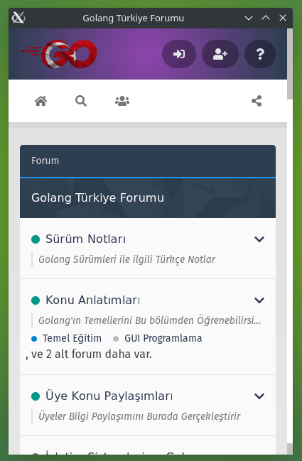

# WebView

**webview** kütüphanesine giriş yapmadan önce bahsetmek istediğim birkaç konu var.  
Daha önce aramızda **electron.js**‘i duyanlar olmuştur. Hani şu Visual Studio Code, Skype, Atom, Discord ve Slack gibi başarılı uygulamaların yazılmış olduğu Javascript kütüphanesinden bahsediyorum. Electron.js ile yazılan uygulamalar **HTML**, **CSS** ve **Javascript**‘in gücüyle kaliteli bir grafiksel kullanıcı arayüzüne ulaşabiliyor. Eğer bir Web Developer’sanız kolayca masaüstü uygulaması yazabiliyorsunuz. Ama Electron.js ile yazılmış uygulamaların kötü yanları da var tabi. Uygulama boyutu bunlardan en sıkıntılı olanı. En basit bir uygulamanın boyutu 150 Megabyte olabiliyor. Bir de **electron-packager** yardımı ile uygulama build edilirken uzun süre bekliyorsunuz.  
Şimdi gelelim bizi bu olaylardan kurtaracak olan gözümün nuru Golang Kütüphanesi olan **webview** kütüphanesine ♥

**webview** kütüphanesi **zserge** arkadaşımız tarafından yazılmış olan, web sayfaları tasarlayıp programa dönüştürebildiğimiz, backend kısmını Golang rahatlığında yazdığımız bir kütüphane \(veya paket\)dir. Build işlemi sonrası aslında elimizde bir internet tarayıcısı olmuş oluyor. Bu tarayıcı üzerinden hazırlamış olduğumuz web sayfası görüntüleniyor. Frontend ve Backend arasındaki iletişimi ise **ExternalInvokeCallback** ile sağlıyoruz. Bu özelliği birazdan kodlar içerisinde açıklayacağım.

Sadece **Windows**, **GNU/Linux** ve **macOS** için uygulama geliştirebiliyoruz.  
GNU/Linux üzerinde **gtk-webkit2**, macOS üzerinde **Cocoa/Webkit** ve Windows üzerinde **MSHTML** \(IE10/11\) alt yapısını kullanıyor. Linux üzerinde çalışması için, gtk-webkit2 paketini yüklemeyi unutmayın. Bu detaylara bakacak olursak, Windows üzerinde çalışırken Internet Explorer’ı kullanacak. macOS ve GNU/Linux üzerinde ise Chrome benzeri bir altyapı kullanacak. Bu durumda GNU/Linux ve macOS için geliştirmek daha mantıklı çünkü daha fazla görsel efekt imkanı var olacaktır. Örnek: CSS3’teki **-webkit-** etiketi…  
Gelelim kütüphanenin kurulumuna. Aşağıdaki komut ile kütüphanemizi indiriyoruz.

> go get github.com/zserge/webview


Kütüphanemizi kurduğumuza göre ufak bir örnek görelim. Daha sonra detaylı örnekler göstereceğim.

```go
package main
import "github.com/zserge/webview"
func main() {
    // Golang TR forumunu 400x600 boyuntunda boyutlandırılabilir olarak açar.
    webview.Open("Golang Türkiye Forumu",
        "https://golangtr.org", 400, 600, true)
}
```




Yukarıdaki gibi basit bir yöntem ile bir **gui** program oluşturabiliyorsunuz. Seviyeyi biraz yükseltelim ve sonraki örneğimize geçelim.

```go
package main
import (
    "fmt"
    "net/http"
    "github.com/zserge/webview"
)
func handler(w http.ResponseWriter, r *http.Request) {
    fmt.Fprintf(w, "Uygulamaya hoşgeldiniz!")
}
func serverOlustur() {
    http.HandleFunc("/", handler)
    http.ListenAndServe(":5555", nil)
}
func main() {
    go serverOlustur()
    webview.Open("Uygulama Başlığı",
        "http://localhost:5555", 400, 400, true)
}
```

Hemen açıklamasını yapayım. Kendi sunucumuzu oluşturmak için **“net/http”** kütüphanesini ekledik. **serverOlustur\(\)** fonksiyonunda klasik web server oluşturmak için gerekli kodları yazdık. Görüntülenecek içeriği **handler\(\)** fonksiyonunda belirttik.  
**main\(\)** fonksiyonu içerisindeki kodlarımıza geçelim. **serverOlustur\(\)** fonksiyonunu **Goroutine** ile yazmazsak web server ayağa kaldırıldığında \(açıldığında\) kapanana kadar alt taraftaki Golang kodlarının çalışmasına sıra gelmez. Başına **go** ekleyerek aynı anda server’ın oluşturulmasına ve diğer kodların çalışmasını sağlıyoruz. **webview** kodlarımızda ise oluşturduğumuz web server’ın bilgilerini ve pencere ayarlarını giriyoruz.  
Biraz değişiklikler ile istediğimiz bir klasörü göstermeye ayarlayabiliriz.

```go
package main
import (
    "fmt"
    "net/http"
    "github.com/zserge/webview"
)
func serverOlustur() {
    http.HandleFunc("/", handler)
    http.ListenAndServe(":5555", nil)
}
func main() {
    klasor := http.FileServer(http.Dir("klasor/")) //Burada klasör yolunu belirtiyoruz
    http.Handle("/", http.StripPrefix("/", klasor))
    go serverOlustur()
    webview.Open("Uygulama Başlığı",
        "http://localhost:5555", 400, 400, true)
}
```

Daha ayrıntılı şekilde webview kodlarını şöyle de yazabiliriz.

```go
    uygulama := webview.New(webview.Settings{
        Title:                  "Golang Türkiye Forumu", //Pencere başlığı
        URL:                    "https://golangtr.org", //Pencere adresi
        Width:                  800, //Pencere genişliği
        Height:                 600, //Pencere Yüksekliği
        Resizable:              false, //Boyutlandırma devredışı
    })
```

Aşağıdaki örneklerde daha açıklayıcı olması için bu şekilde yazacağız.  
Sıra geldi Backend \(Golang\) ve Frontend \(Javascript\) arasındaki iletişimi sağlamaya.  


**Frontend’den Backend’e Veri Gönderme \(Javascript ===&gt; Golang\)**  
Bu işlemi gerçekleştirebilmemiz için webview tarayıcısının frontend’deki sinyalleri dinlemesi gerekir. Bu özelliğin kullanımı şöyledir.

```text
    uygulama := webview.New(webview.Settings{
        Title:                  "Golang Türkiye Forumu",
        URL:                    "https://golangtr.org",
        Width:                  800,
        Height:                 600,
        Resizable:              false,
        ExternalInvokeCallback: Yakala, //Buraya Dikkat - yanına () parantezler koymadan yazıyoruz.
    })
```

**ExternalInvokeCallback** özelliğine **Yakala** yazdık. **Yakala** bizim tarayıcı sinyallerini dinleyeceğimiz fonksiyonumuz olacak. Sinyal deyince gözünüz korkmasın. Sinyal derken Frontend’den gönderilecek kelimeleri kastediyorum.  
Yakala\(\) fonksiyonumuz ise şöyle olacak.

```go
func Yakala(uygulama webview.WebView, data string) {
    switch data {
        case "cikis":
            uygulama.Exit()
        case "tamekran":
            uygulama.SetFullscreen(true)
    }
}
```

Aslında kodlar kendi açıklıyor ama yine de açıklamasını yapayım.  
**Yakala\(\)** fonksiyonu parantezleri içerisine **uygulama webview.WebView** yazmamızın sebebi uygulama değişkeni üzerinden pencerede işlemler yapabilmektir. **data string** ile frontend’den aldığımız sinyalleri **data** değişkenine kaydedeceğiz.  
**switch** yerine **if-else** kullanabilirdik fakat **switch**‘in görünümü daha sade olduğundan switch’i tercih ettim. **data** değişkenine **“cikis”** yazılı sinyal geldiğinde **uygulama.Exit\(\)** işlemini yapacak olduğunu görüyoruz. Golang tarafı bu kadar basit. Javascript tarafı dah da basit. Sinyalleri izlemeyi gördüğümüze göre nasıl sinyal gönderildiğini görelim. Örnek olarak butona tıkladığında sinyal gönderilmesini görelim.  
**HTML Kodumuz:**

```markup
<button id="butonum">Çıkış</button>
```

**Javascript Kodumuz:**

```javascript
function yazdir(yazi){
    document.getElementsByTagName("body").innerHTML(yazi)
}
```

Görüldüğü üzere bu kadar basit bir işlem.  


**Backend’den Frontend’e Veri Gönderme \(Golang ===&gt; Javascript\)**  
Çok kolay bir işlemle bunu gerçekleştirebiliriz. Bu işe yarayan fonksiyonumuz **Eval\(\)** fonksiyonu oluyor. Diyelim ki web sayfamızda aşağıdaki gibi bir Javascript kodu var.

```javascript
function yazdir(yazi){
    document.getElementsByTagName("body").innerHTML(yazi)
}
```

Buradaki **yazdir\(\)** fonksiyonunun görevi sayfadaki body etiketleri arasındaki içeriği değiştirmektir. Örnek olarak **yazdir\(“Merhaba”\)** denildiğinde sayfada **“Merhaba”** yazısı belirecektir.  
Bizim bu Javascript fonksiyonunu Golang üzerinden tetiklememiz için Golang tarafına aşağıdaki kodu yazmamız gerekir.

```go
uygulama.Eval("yazdir('Merhaba')")
```

İşte WebView kütüphanesi ile ilgili bir kaç ayar kodu:

```go
Title string //Pencere başlığını ayarlama
URL string //Açılacak sayfanın URL'sini ayarlama
Width int //Açılacak pencerenin genişliğini ayarlama
Height int //Açılacak pencerenin yüksekliğini ayarlama
Resizable bool //Açılacak pencenin boyutu ayarlanabilir mi?
Debug bool //Normal tarayıcılarda F12'e basınca çıkan ekran aktif mi? (Sağ tıklayınca açılır)
ExternalInvokeCallback YakalaFonksiyonumuz //Sinyalleri yakalayan fonksiyonumuz girilir
```

İşte uygulama değişkenimize iliştirebileceğimiz fonksiyonlar:

```go
Run() //Pencereyi başlatır
Loop(bloklama bool) //Ana pencerenin tek bir yinelemesini çalıştırır
SetTitle(başlık string) //Pencere başlığını değiştirir
SetFullscreen(true/false) //Penceyi tam ekran yapar veya küçültür
SetColor(r, g, b, a uint8) //Pencere arkaplan rengini ve saydamlığını ayarlar
Eval(js string) error //Pencereye Javascript kodu enjekte eder. İstenirse hata da döndürülebilir
InjectCSS(css string) //Pencereye CSS kodu enjekte eder
Dialog(diyalogtipi DialogType, flags int, başlık string, arg string) string
//Sistem diyalog penceresini gösterir ve string olarak çıktı verir
Terminate() //Ana pencere yinelemesini durdurur
Dispatch(func()) //Ana pencerede yürütülecek bazı işleri zamanlar
Exit() //Pencereyi kapatır ve kaynakları temizler
```

